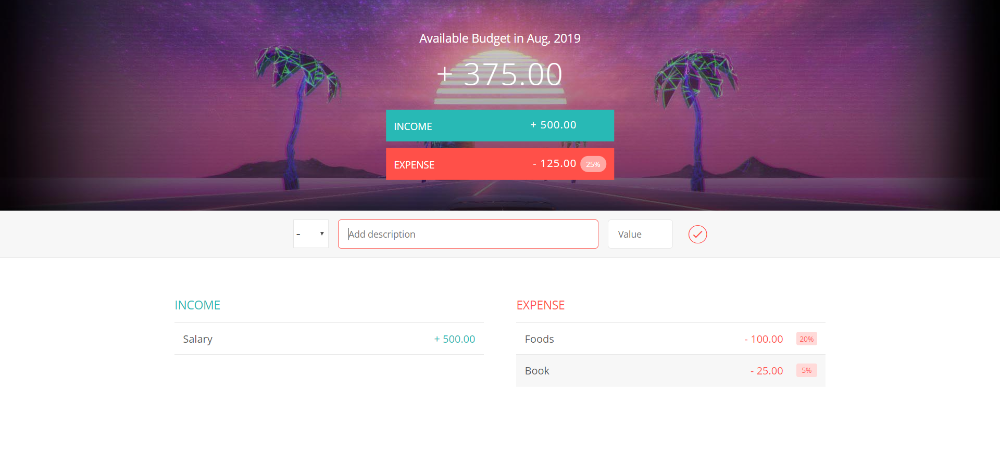

# VanillaJS Budget Web Application
This project presents a budget application with GitHub pages. The original idea comes from the Udemy course of Jonas Schmedtmann. 

This budget app allows the visitor to:
* record their incomes and epxenses
* calculate the total budget automatically
* display the percentage of each expense
* delete any income and expense 

